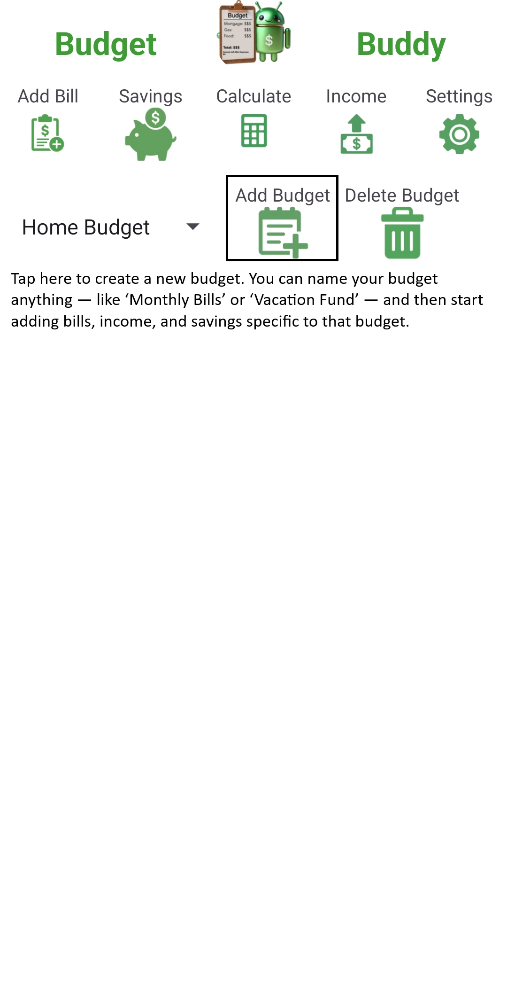

Budget Buddy is a mobile budgeting app designed to help users easily track their incomes, bills, and expenses. With a simple and intuitive interface, 
Budget Buddy makes personal finance management straightforward and accessible — perfect for anyone looking to take control of their money without the 
complexity of traditional budgeting software.

Features
Track Budgets: Add and manage multiple budgets with specific bills and income entries.
Expense Calculation: Calculate your available spending money after accounting for upcoming bills.
Simple User Interface: Designed to be user-friendly and minimal for quick access and ease of use.
Manual Testing Focus: Thoroughly tested to ensure reliability and stability.

  
  
  
  

Installation

Usage
Open the app and tap the Add Budget button.
Enter income sources and bill payments.
Use the Calculate button to view your available spending money.
Long-press budget items to delete them as needed.

Development
Development Environment: Android Studio

Language: Java

Source Control: GitHub

Coding Standards: Follows Android best practices and Material Design principles.

Testing
Testing Strategy: Manual testing across various Android devices and screen sizes.
Test Cases: Core functionality such as adding, deleting, and calculating budgets has been validated manually.

Contributing
At this time, Budget Buddy is in its open testing phase. Stay tuned for updates!

License
Currently not licensed for public use. All rights reserved.

Support
For issues and bug reports, please visit the GitHub Issues page or contact us through the app support email.

